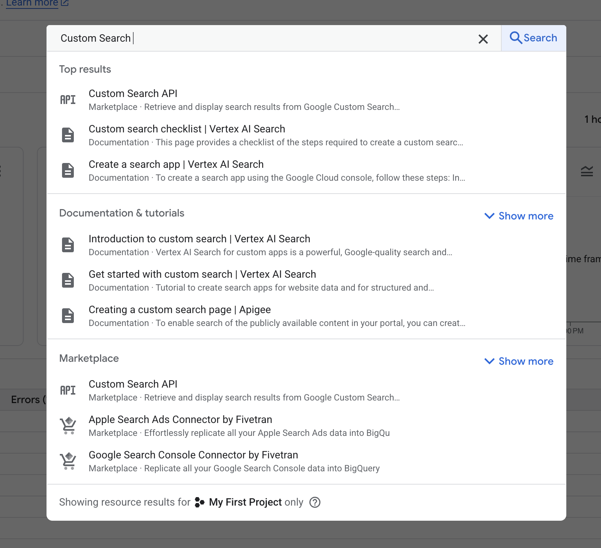
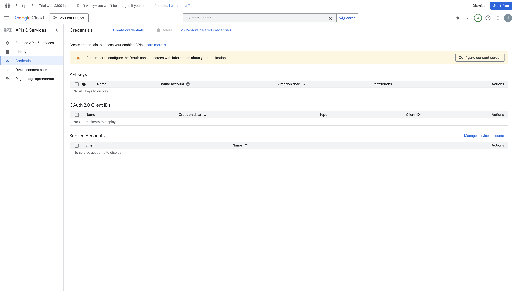
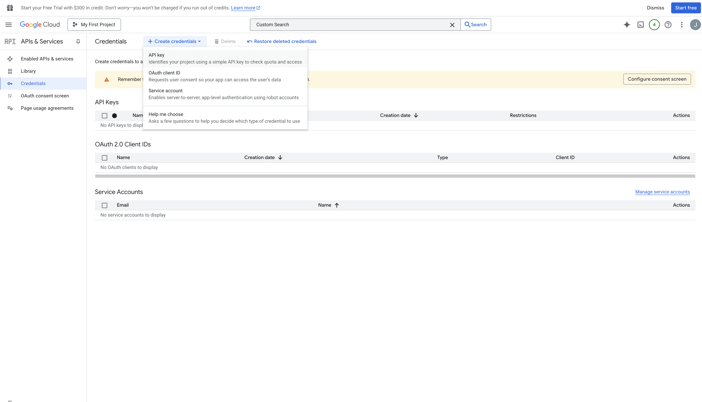
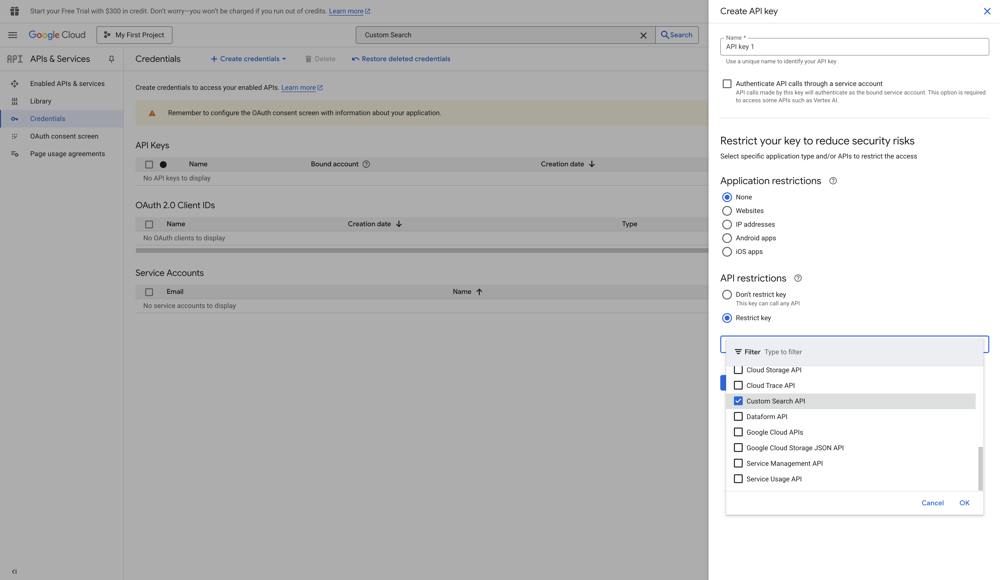
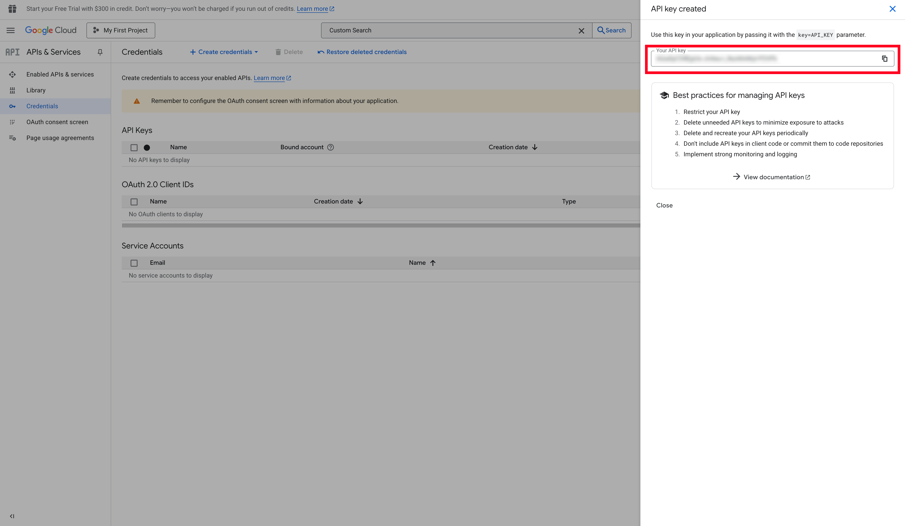
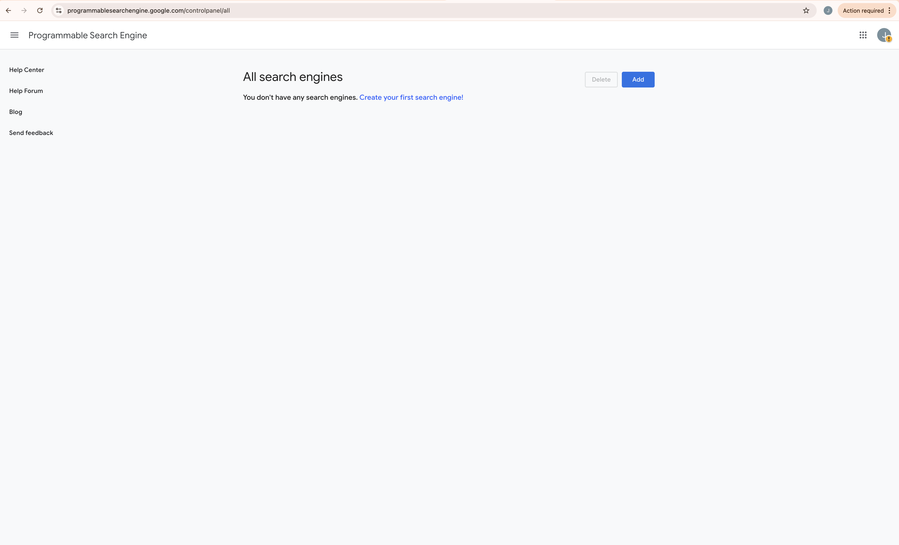
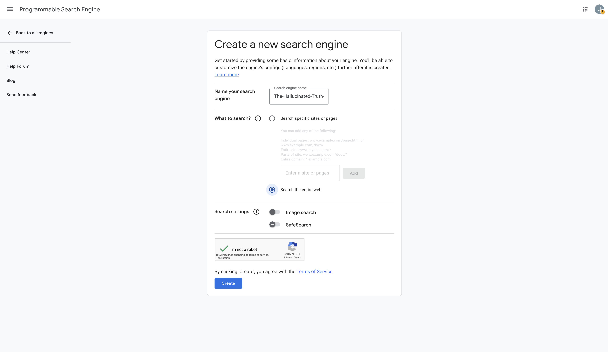
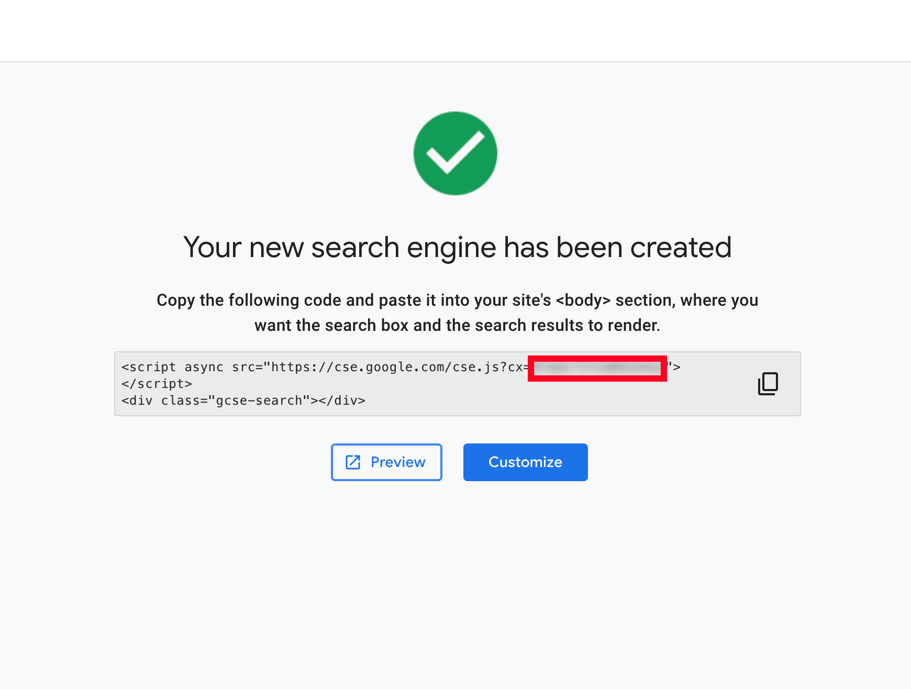

<kbd></kbd>
# The Hallucinated Truth

A game that evolved from looking into learning [Temporal](https://temporal.io/) for a job application.

This README explains how to install, configure, and run the entire stack locally using Docker.

## 💡 About the Game — Where “The Hallucinated Truth” Came From

The Hallucinated Truth is inspired by the BBC radio comedy panel show [“The Unbelievable Truth”](https://en.wikipedia.org/wiki/The_Unbelievable_Truth_(radio_show)). Depending on your region (or a VPN) you may be able to sample it on YouTube [here](https://www.youtube.com/watch?v=J7m6qiBdxhA).
In that show, a contestant delivers a story on a given topic where nearly everything is nonsense...apart from a few true statements which are hidden inside.
The other players must spot and call out the truths buried within the lies.

I thought it would be fun to recreate this format using an LLM.

Large Language Models hallucinate all the time, so instead of avoiding that behaviour, this game leans into it.
The agent generates a story filled with believable and unbelievable nonsense, hides real facts inside it, and your task is to uncover the truths.

This project is a blend of [Temporal](https://temporal.io/), [LangChain](https://www.langchain.com/), [Ollama](https://ollama.com/), [Custom Google Search API](https://developers.google.com/custom-search/v1/introduction), some Javascript and a handful of overly verbose prompts to let an LLM play a variant of “The Unbelievable Truth” against you.

---

## Table of Contents

- [The Hallucinated Truth](#the-hallucinated-truth)
- [About the Game — Where “The Hallucinated Truth” Came From](#-about-the-game--where-the-hallucinated-truth-came-from)
- [Overview](#overview)
- [Prerequisites](#prerequisites)
- [Create Google Custom Search Credentials](#create-google-custom-search-credentials)
  - [Log-in to Google Developer Console](#log-in-to-google-developer-console)
  - [Create a New Project](#create-a-new-project)
  - [Enable the Custom Search API](#enable-the-custom-search-api)
  - [Create an API Key (GOOGLE_API_KEY)](#create-an-api-key-google_api_key)
  - [Create a Programmable Search Engine (GOOGLE_CSE_ID)](#create-a-programmable-search-engine-google_cse_id)
- [Install and Run Temporal](#install-and-run-temporal)
- [Clone This Repository and Configure Environment Variables](#clone-this-repository-and-configure-environment-variables)
- [Start the Application](#start-the-application)
- [Optional: Running Ollama Natively for Better Performance (Highly Recommended)](#optional-running-ollama-natively-for-better-performance-highly-recommended)
  - [Why Native Ollama Is Faster](#why-native-ollama-is-faster)
  - [Install Ollama Natively](#install-ollama-natively)
  - [Remove Ollama Container From Docker Compose](#remove-ollama-container-from-docker-compose)
  - [Restart Everything](#restart-everything)
  - [Summary](#summary)
- [Using the App (High-Level)](#using-the-app-high-level)
- [Troubleshooting](#troubleshooting)
  - [Temporal UI doesn’t load](#temporal-ui-doesnt-load)
  - [llama3:latest model not available](#llama3latest-model-not-available)
  - [.env not being picked up](#env-not-being-picked-up)
  - [Ports already in use](#ports-already-in-use)
- [You’re Ready to Play](#youre-ready-to-play)

---

## Overview

This project bundles:

- A **Temporal workflow** controlling the game logic  
- A **LangChain agent** using `llama3:latest` for reasoning and **Google Custom Search API** to find truths
- An **Ollama server** to run the model locally  
- An **NGINX web interface**  
- An optional **Open WebUI** for interacting with Ollama directly

The result is a playable “truth-finding” game where the LLM makes statements, you interrogate them, and Temporal orchestrates the entire back-and-forth.

---

## Prerequisites

You will need:

- Docker Desktop  
- Git  
- A Google Developer Console account  
- macOS, Linux, or Windows with WSL2  

**⚠️ Performance Notice for macOS (M-Series Recommended)**

Running Ollama **inside Docker** is significantly slower on macOS because virtualisation prevents direct access to Apple’s GPU and Metal acceleration. Running Ollama locally on a Mac M3 improved the performance by around a factor of 5.

For an M1/M2/M3/M4 Mac, you must increase Docker’s resource allocation if you keep Ollama in Docker.

Recommended Docker Desktop settings (for a 64 GB M3 MacBook Pro):

- CPU: **12 cores**  
- Memory: **48 GB**  
- Swap: **2 GB**  
- Disk image size: **200+ GB**  
- Resource Saver: Disable or set a long timeout  
- Virtualization Framework: Default (Apple Virtualization)

If you want far better performance, you should run **Ollama natively**, not inside a container.  
A full section below explains how to do this.
---

## Create Google Custom Search Credentials

This app uses Google’s **Custom Search API**. Google provides **100 free searches per day**, so you can test without enabling billing.

You will obtain two values:

- `GOOGLE_API_KEY`  
- `GOOGLE_CSE_ID`  

These will be added to a `.env` file later.

---

### Log-in to Google Developer Console

Go to:

    https://console.developers.google.com/

If you don’t already have an account, create one.  
You do **not** need to add billing details just to test this project.

---

### Create a New Project

If you already have several projects, it’s cleaner to make a new one:

1. Click the project selector at the top of the page.  
2. Choose **New Project**.  
3. Give it a name (for example: `llama-agent-search`).  
4. Click **Create**.

If this is your first time in Google Developer Console, Google will automatically create a default project such as **My First Project** when you carry out the next step.

---

### Enable the Custom Search API

1. In the top search bar, type:

       Custom Search API

<kbd></kbd>

2. Click the result named **Custom Search API**.

<kbd></kbd>

3. Click the **Enable** button.

If this is your first time using Google Developer Console, enabling the API will also create your first project automatically.

---

### Create an API Key (GOOGLE_API_KEY)

1. In the left sidebar, click **Credentials**.

<kbd></kbd> 

2. At the top, click **+ Create Credentials**.

<kbd></kbd>    

3. Select **API key**.  

4. A sidebar appears for you to configure your new key.

<kbd></kbd>

Now restrict it:

1. In the sidebar, find **API restrictions**.  
2. Select **Restrict key**.  
3. Choose **Custom Search API** from the dropdown.  
4. Save your changes.

<kbd></kbd>

Copy the generated key – this is your:

    GOOGLE_API_KEY

Keep it somewhere safe.

---

### Create a Programmable Search Engine (GOOGLE_CSE_ID)

Now we need to create the Programmable Search Engine that will back the Custom Search API:

1. Go to:

       https://programmablesearchengine.google.com/

<kbd></kbd>

3. Click **Add**.  
4. Give your search engine a name.

<kbd></kbd>

5. Configure it so it can search the **entire web**.  
6. Click **Create**.

You will then see an embed snippet that looks something like:

    

Copy only the value after `cx=`. That is your:

    GOOGLE_CSE_ID

<kbd></kbd>

You now have both values required for the `.env` file.

---

## Install and Run Temporal

Temporal orchestrates the long-running game workflows. The easiest way to run it locally is by using the official Temporal Docker Compose setup.

You can follow the Temporal instructions [here](https://github.com/temporalio/docker-compose) in more detail or just follow these instructions.

1. Clone the Temporal Docker Compose repository into a suitable folder (for example, wherever you keep your Docker-related projects):

        git clone https://github.com/temporalio/docker-compose.git ./temporal

2. Move into the new directory:

        cd temporal

3. Start Temporal with Docker Compose:

        docker compose up -d

    Docker will pull all required Temporal images and start them in the background.

4. To confirm it’s running, open a browser and go to:

        http://localhost:8080/

If you see the Temporal Web UI, your Temporal backend is up and ready.

---

## Clone This Repository and Configure Environment Variables

Next, clone the game and agent code itself. 

1. From the root of your Docker projects folder (or wherever you prefer to keep this project), run:

        git clone https://github.com/rilhia/the-hallucinated-truth.git ./the-hallucinated-truth

    This will create a folder named:

        the-hallucinated-truth

    and clone everything needed to run the game, **except** the `.env` file.

2. Move into the project directory:

        cd the-hallucinated-truth

    You can verify with:

        pwd

3. Now create the `.env` file and insert the Google credentials you created earlier:

        cat > .env <<'EOF'
        GOOGLE_API_KEY=xxxxxxxxxxxxxxxxxxxxxxx
        GOOGLE_CSE_ID=xxxxxxxxxxxxxxxxxxxxxxxx
        EOF

    Replace the `x` values with your actual `GOOGLE_API_KEY` and `GOOGLE_CSE_ID`.

At this point, the project is configured with the Google credentials it needs.

---

## Start the Application

Make sure Temporal is still running (it will be unless you stopped the containers manually).

From the root of the `the-hallucinated-truth` folder, start the full stack:

    docker compose up -d

On the first run, this may take a while. Docker will:

- Pull **Node** (backend app)  
- Pull **nginx:alpine** (front-end gateway / reverse proxy)  
- Pull **Ollama** (local LLM runtime)  
- Pull **Open WebUI** (browser-based UI for Ollama)  
- Pull the **`llama3:latest`** model for Ollama  

Once everything is pulled and started, the app’s web interface will be available at:

    http://localhost:8085/

Open that URL in your browser to access **The Hallucinated Truth**.

---

## Optional: Running Ollama Natively for Better Performance (Highly Recommended)

### Why Native Ollama Is Faster

Ollama inside Docker runs under Linux virtualisation and **cannot access Apple Metal acceleration**.  
Native Ollama uses:

- Direct CPU/GPU access  
- Metal acceleration  
- No virtualization overhead  

This produces **2–6× faster inference** on M-series Macs.

### Install Ollama Natively

Download for macOS:

https://ollama.com/download/mac

Install and verify:

    ollama –version

Start the server:

    ollama serve

Pull the model:

    ollama pull llama3:latest

Native Ollama listens on:

    http://localhost:11434

### Remove Ollama Container From Docker Compose

Remove or comment out the `ollama:` service:

    ollama:
      image: ollama/ollama:latest
      container_name: hallucinated_ollama
      ports:
        - "11434:11434"
      volumes:
        - ollama_data:/root/.ollama
      restart: unless-stopped
      entrypoint: ["/bin/sh", "-c"]
      command: |
        "
        # Start Ollama in background
        ollama serve &

        # Wait for API to come up
        sleep 3

        echo 'Pulling Llama 3 8B...'
        ollama pull llama3:latest

        # Keep container alive
        wait
        "
      networks:
        - webnet

### Restart Everything

    docker compose down
    docker compose up -d

Ensure native Ollama is running:
    
    ollama serve

### Summary

| Mode | Speed | GPU | Notes |
|------|-------|-----|-------|
| Dockerised Ollama | Slowest | No GPU | Easiest setup |
| Native Ollama | Fastest | Uses GPU  | Recommended for all M-series Mac users |

---

## Using the App (Detailed Walkthrough)

Once the stack is running via Docker Compose, you will have **three separate web interfaces** available. Each serves a different purpose and together they form the full game system.

---

### Available Web Interfaces

| Service | URL | Purpose |
|------|----|----|
| Game UI | http://localhost:8085/ | Play *The Hallucinated Truth* |
| Temporal Web UI | http://localhost:8080/ | Inspect workflows, activities, and execution history |
| OpenWebUI (Ollama) | http://localhost:3000/ | Optional UI for interacting directly with your local LLM |

---

## 1. The Game UI (http://localhost:8085/)

This is where the game is played.

### Starting the Game

1. Open **http://localhost:8085/**
2. You will see an initial screen that allows you to:
   - Resume an existing game
   - Inspect a game already in progress
   - Start a new game

3. Click **Start New Game**

---

### Selecting a Subject

You will be prompted to choose a subject for the game.

- Enter a subject name (for example: **Gene Wilder**)
- Click **Generate Story**

At this point the game begins its backend processing.

---

### Story Generation Phase

While the story is being generated you will see live status updates in the UI.

Behind the scenes, the following happens:

1. The game searches the web using **Google Custom Search**
2. A small set of real, verifiable facts is extracted
3. These facts are passed to the LLM
4. The LLM generates a long, absurd story where:
   - Most statements are fabricated
   - A small number of true facts are deliberately embedded

This phase can take some time depending on:
- Your machine’s performance
- Whether Ollama is running inside Docker or directly on your host

Once complete, the full story is rendered in the UI.

---

### Identifying the Hidden Truths

After the story appears, a new section becomes visible:

**“Explain each truth one by one”**

This section contains:
- A text input field
- A **Submit Explanation** button
- A **No More Truths** button

Your task is to read the story carefully and identify real facts hidden among the hallucinations.

#### Submitting a Guess

1. Type a description of a fact you believe is true
2. Click **Submit Explanation**

Important details:
- This is **not** a string match
- The LLM is used to evaluate *semantic intent*
- You only need to describe the fact correctly, not quote it verbatim

##### Possible Outcomes

- ❌ **Incorrect**
  - Your explanation does not match any embedded truth
- ✔ **Correct**
  - The game shows:
    - The exact factual statement
    - One or more source links where the fact was found

---

### Ending the Game

When you believe you have found all the hidden truths:

1. Click **No More Truths**

The game will then display a full review, including:
- All your guesses
- Which guesses were correct
- Which truths were missed
- Source links for every factual statement
- A final score

---

### Example Game Output

**Game Summary**
- Correct guesses
- Incorrect guesses
- Missed truths with sources
- Final score

---

## 2. Temporal Web UI (http://localhost:8080/)

Temporal is responsible for orchestrating the game logic.

### How Temporal Is Used

- **Each game session is a Temporal workflow**
- Each step of the game is handled by **activities**, such as:
  - Searching Google
  - Extracting facts
  - Reducing fact lists
  - Calling the LLM
  - Evaluating player guesses
  - Scoring the game

Temporal ensures that:
- Long-running operations are reliable
- Game state is preserved
- Each step can be inspected and replayed

### Inspecting a Game Workflow

1. Open **http://localhost:8080/**
2. Go to **Workflows**
3. Locate the workflow corresponding to your game session
4. Click into it to inspect:
   - Execution history
   - Activity inputs and outputs
   - Timing and retries
   - Signals sent from the UI

This is particularly useful if you want to understand *how the game actually runs*, or if you are debugging or extending the system.

*(Screenshot of the Workflows page can be added here)*

---

## 3. OpenWebUI for Ollama (http://localhost:3000/)

OpenWebUI is an optional but useful extra.

### What It Is

- A web interface for interacting directly with your local Ollama models
- Included primarily for experimentation and exploration
- **Not required** to play the game

### Using OpenWebUI

1. Open **http://localhost:3000/**
2. Create a local account
3. Select a model from the model dropdown (preconfigured for `llama3:latest`)
4. Start chatting with your own local LLM

This allows you to:
- Ask arbitrary questions
- Experiment with prompts
- Understand how the LLM behaves outside the game

> Note: If you plan to use Ollama heavily, running it directly on your host machine (outside Docker) will usually give better performance. OpenWebUI is included here mainly for convenience and exploration.

*(A screenshot of the model selection dropdown can be added here)*

OpenWebUI documentation:
https://docs.openwebui.com/

---

## Summary

- **http://localhost:8085/** — Play the game
- **http://localhost:8080/** — Observe and debug game workflows in Temporal
- **http://localhost:3000/** — Experiment directly with your local LLM

Together, these components demonstrate how LLMs, orchestration engines, and real-world data can be combined into a structured, inspectable, and deliberately playful system.

---

## Troubleshooting

### Temporal UI doesn’t load

- Check that Docker Desktop is running.  
- Restart the Temporal stack:

      cd temporal
      docker compose up -d

- Confirm again at:

      http://localhost:8080/

---

### `llama3:latest` model not available

If downloading the model via the stack fails, you can try pulling it manually with Ollama (if you have Ollama installed locally):

    ollama pull llama3:latest

Then restart the app containers:

    cd the-hallucinated-truth
    docker compose up -d

---

### `.env` not being picked up

- Ensure that:

      .env

  exists in the root of `the-hallucinated-truth` (the same directory as `docker-compose.yml`).

- Make sure you ran:

      docker compose up -d

  from inside the `the-hallucinated-truth` directory.

---

### Ports already in use

If `8080` or `8085` are already in use:

- Stop the conflicting service, or  
- Update the `docker-compose.yml` file to map the services to different host ports, then restart:

      docker compose down
      docker compose up -d

---

## You’re Ready to Play

With all containers running:

- Temporal is orchestrating workflows.  
- Ollama is serving `llama3:latest`.  
- Google Custom Search is providing grounded web results.  
- The front-end is live at `http://localhost:8085/`.

You can now play **The Hallucinated Truth**, inspect Temporal workflows, and experiment with an LLM that has to justify its own “hallucinations” against real-world data.
